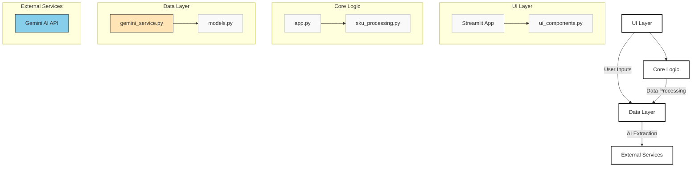

# SKU Quotation Comparator Architecture Diagram

```mermaid
graph TD
    A[UI Layer] --> B[Core Logic]
    A -->|User Inputs| C[Data Layer]
    B -->|Data Processing| C
    C -->|AI Extraction| D[External Services]
    
    subgraph UI Layer
        A1[Streamlit App] --> A2[ui_components.py]
    end
    
    subgraph Core Logic
        B1[app.py] --> B2[sku_processing.py]
    end
    
    subgraph Data Layer
        C1[gemini_service.py] --> C2[models.py]
    end
    
    subgraph External Services
        D1[Gemini AI API]
    end
    
    style C1 fill:#FFE4B5,stroke:#333
    style D1 fill:#87CEEB,stroke:#333
    
    classDef layer fill:#ffffff,stroke:#000,fill:#fff,stroke-width:2;
    classDef module fill:#f9f9f9,stroke:#bbb,fill:#f9f9f9,stroke:#bbb,stroke-width:1;
    classDef external fill:#FFE4B5,stroke:#333;
    
    class A layer
    class B layer
    class C layer
    class D layer
    class A1 module
    class A2 module
    class B1 module
    class B2 module
    class C1 module
    class C2 module
    class D1 external
```