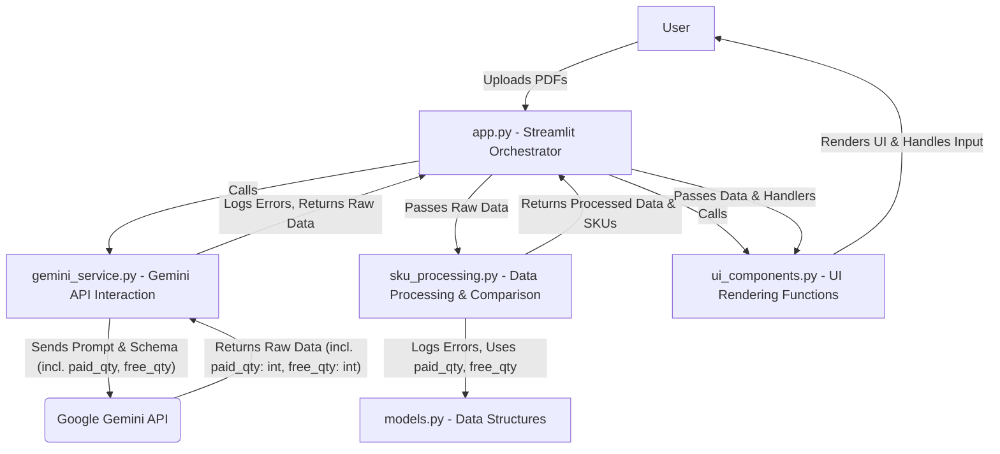

# Plan for Extracting Paid and Free Quantities Directly from Gemini

## Objective

Modify the application to extract `paid_qty` and `free_qty` as separate integer fields directly from the Gemini API response, eliminating the need for regex parsing in `sku_processing.py`. Implement logging for unsuccessful extraction or data conversion cases using Python's standard `logging` module.

## Current State

Currently, the application extracts a single `qty_str` from Gemini and uses a regex function (`parse_quantity_string`) in `sku_processing.py` to split it into paid and free quantities.

## Proposed Plan

1.  **Update the data model (`models.py`)**:
    *   Modify the `RawSkuItem` dataclass to include `paid_qty` and `free_qty` fields, expecting them as integers directly from Gemini.
2.  **Update the Gemini service (`gemini_service.py`)**:
    *   Modify the prompt sent to Gemini to explicitly request the extraction of `paid_qty` and `free_qty` as separate integer fields.
    *   Update the JSON response schema to include these new fields with the `INTEGER` type.
    *   Add logging (using Python's `logging` module) within the JSON parsing logic to record errors if the expected quantity fields are missing or the JSON structure is invalid.
3.  **Update the SKU processing logic (`sku_processing.py`)**:
    *   Remove the existing `parse_quantity_string` function.
    *   Modify the `preprocess_data` function to directly retrieve `paid_qty` and `free_qty` from the raw data dictionary provided by `gemini_service.py`.
    *   Add logging (using Python's `logging` module) to catch and report any issues if the extracted `paid_qty` or `free_qty` values from the raw data are not valid integers or are missing, skipping the item if necessary.
    *   Update the creation of `qty_display_str` to use the newly extracted integer `paid_qty` and `free_qty`.
4.  **Review and Refactor**: Ensure that downstream functions like `calculate_item_metrics` and `generate_comparison_table` correctly use the integer `paid_qty` and `free_qty` from the `ProcessedSkuItem`.

## Data Flow (Proposed)

## Logging

Logging for unsuccessful quantity extraction or data conversion will be implemented using Python's standard `logging` module for backend diagnostics.