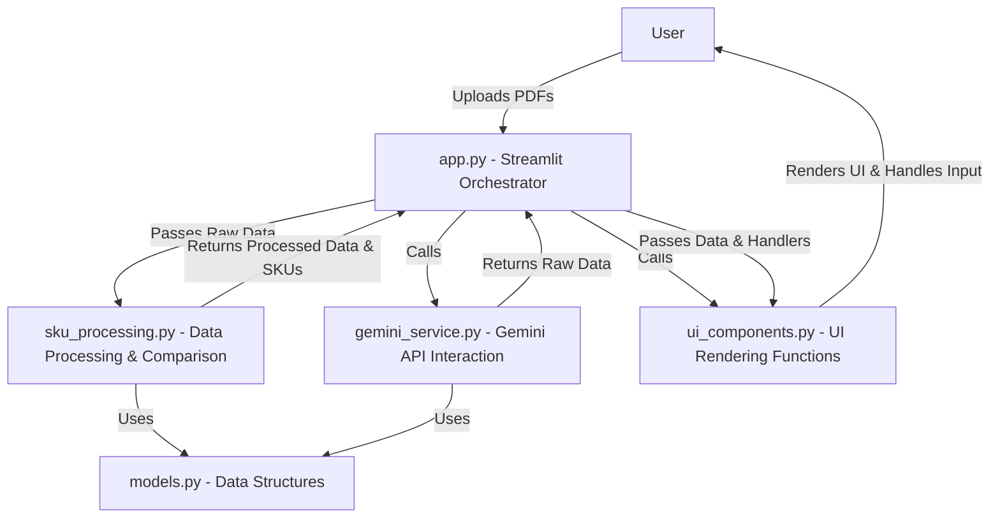

# SKU Quotation Comparator: Architecture Document

## Introduction

This document outlines the architecture of the SKU Quotation Comparator application. The application is designed to process PDF quotation files, extract SKU data using the Google Gemini AI API, compare pricing across different suppliers, and present the results in a user-friendly Streamlit interface. The architecture emphasizes modularity and separation of concerns to enhance maintainability, testability, and scalability.

## Objective

The primary objective of this rearchitecture was to transform the initial monolithic `app.py` script into a well-structured, modular application. This involved breaking down the functionality into logical components, each with a specific responsibility, to improve code organization and facilitate future development and maintenance.

## Architecture Design: Modular Breakdown

The application is structured into the following key modules:

1.  **`app.py`**:
    *   **Role:** Serves as the main entry point and orchestrator of the Streamlit application.
    *   **Responsibilities:**
        *   Sets up the Streamlit page configuration.
        *   Initializes and manages the application's session state.
        *   Calls functions from other modules to handle user interactions and application flow.
        *   Does **not** contain core business logic, data processing, or UI rendering details.

2.  **`models.py`**:
    *   **Role:** Defines the data structures used throughout the application.
    *   **Responsibilities:**
        *   Contains Python classes or data structures (using `dataclasses`) to represent the shape of data at different stages of the application.
        *   Defines `RawSkuItem` for data directly extracted from the Gemini API.
        *   Defines `ProcessedSkuItem` for data after cleaning, parsing, and calculating relevant metrics.
        *   Provides clear data contracts, improving type hinting and code clarity.

3.  **`gemini_service.py`**:
    *   **Role:** Handles all interactions with the Google Gemini AI API.
    *   **Responsibilities:**
        *   Manages the process of uploading PDF files to the Gemini API.
        *   Sends prompts and configuration to the Gemini API for data extraction.
        *   Parses the JSON response received from the API.
        *   Handles potential API errors and exceptions.
        *   Abstracts the details of the Gemini API, allowing other modules to interact with it through a simple function call (`run_gemini_extraction`).

4.  **`sku_processing.py`**:
    *   **Role:** Contains the core data processing and comparison logic.
    *   **Responsibilities:**
        *   Includes functions for parsing quantity strings (e.g., "10+1").
        *   Calculates key metrics such as effective rate and effective discount.
        *   Preprocesses the raw data from the Gemini service into a standardized format (`ProcessedSkuItem` objects).
        *   Determines the best deal for each SKU based on defined criteria.
        *   Generates the final pandas DataFrame used for the comparison table display.
        *   This module is independent of the Streamlit UI and could potentially be reused in a different context.

5.  **`ui_components.py`**:
    *   **Role:** Responsible for rendering specific elements and sections of the Streamlit user interface.
    *   **Responsibilities:**
        *   Contains functions for rendering the file uploader, SKU selection multiselect, comparison table, notes, and raw data expander.
        *   Includes the logic for styling the comparison table (e.g., highlighting the best deal).
        *   These functions take necessary data and handler functions (from `app.py`) as arguments to remain focused on presentation.

## Data Flow

The data flows through the application in the following sequence:

1.  User uploads PDF files via the UI (`ui_components.py` called by `app.py`).
2.  `app.py` calls `gemini_service.py` to upload files and extract raw data.
3.  `gemini_service.py` interacts with the Gemini API and returns raw data (list of dictionaries) to `app.py`.
4.  `app.py` passes the raw data to `sku_processing.py` for preprocessing.
5.  `sku_processing.py` transforms the raw data into `ProcessedSkuItem` objects and performs calculations.
6.  `app.py` receives the processed data and a list of unique SKU names from `sku_processing.py`.
7.  `app.py` uses `ui_components.py` to render the SKU selection based on the unique SKU names.
8.  User selects SKUs via the UI (`ui_components.py` called by `app.py`).
9.  `app.py` calls `sku_processing.py` to generate the comparison table DataFrame using the selected SKUs and processed data.
10. `app.py` passes the DataFrame to `ui_components.py` for rendering the comparison table, including applying styling.
11. `ui_components.py` renders the final comparison table in the Streamlit application.

## Visual Representation

## Decisions Made

*   **Modular Architecture:** Chosen to improve code organization, maintainability, and testability.
*   **Separation of UI Components:** Streamlit UI rendering logic is separated to make `app.py` cleaner and focus on application flow.
*   **Data Classes for Models:** Using `dataclasses` provides a clear and concise way to define data structures.
*   **Centralized Session State in `app.py`:** Streamlit's session state is managed in the main `app.py` file to keep the state management logic in one place.

## Future Enhancements

*   Implement unit tests for `models.py`, `gemini_service.py`, and `sku_processing.py`.
*   Add more robust error handling and logging.
*   Improve the SKU name matching logic in `sku_processing.py`.
*   Explore options for handling different document formats (e.g., DOCX, XLSX).
*   Implement user authentication and authorization.

This document provides a detailed overview of the rearchitected application's structure and design.